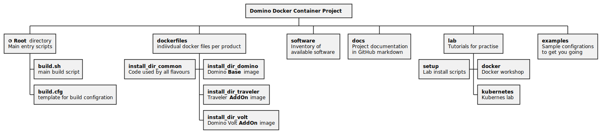

# Domino Container Components

## build.sh

Main start point for building docker images.
You can specify the image to build.

The following images are supported

- **domino** - Domino 12
- **traveler** - Traveler 12
- **volt** - HCL Domino Volt 1.x

The file `software.txt` contains an up to date list of current HCL Domino related software.
Unless you specify a distinct version the current version will be installed and tagged as "latest".
 
Inside this script you can configure a remote download HTTP(S) target if you are hosting the downloaded software on a different machine.
You can also specify a download directory on your Docker host which will be served by a temporary Docker container running a [NGINX container](https://hub.docker.com/_/nginx) to provide the software.

The following three options are available
1. Remote Download specified with example: `DOWNLOAD_FROM=http://192.168.1.1`
2. Local directory specified with example: `SOFTWARE_DIR=/local/software` hosted via NGINX container
3. Standard location in the software sub-directory hosted via NGINX server in temporary container

Before you start you have to download the required software packages.

## Directory "software"

This directory is the default directory to provide Domino software, which are downloaded by the Docker installation script.
The build script checks if your selected software is available on the defined software location and will prompt you which package to download if missing.

## software.txt

This file contains information about the download you have to download depending on what you install.
This file is used to find the right file to download by product and version. And is also used to verify the downloaded image via SHA256 hash.

The format of the file is as follows:


```
product|version|filename|product-code|sha256-hash
```


Example:
```
domino|12.0.1|Domino_12.0.1_Linux_English.tar|-|a9d561b05f7b6850ed1230efa68ea1931cfdbb44685aad159613c29fa15e5eea
```

## current_version.txt

Contains one line per product to define the latest software verison


## Directory "dockerfiles"

Contains a sub-directory for each product that can be installed.
- `install_dir_domino` contains all files needed to install a HCL Domino server.
- `install_dir_common` contains common components used by other container images like Traveler and Volt.

Those files are copied to /tmp/install_dir during install process and are invoked by the build process.

# dockerfile

Main `dockerfile` used to build Domino. All customization and logic is either in the build.sh script or in the installer script.
Each add-on product has it's own file. Example: `dockerfile_traveler`.

# install_domino.sh

Contains the install logic and performs the actual install of all components after downloading the software.


## entrypoint.sh

- Located in `/` owned by root
- Main entry point started when the container is started
- Contains the logic to start and stop the server.
- Contains the logic triggered at first server start to invoke the configuration of the server.

## domino_prestart.sh

- Located in `/domino-container/scripts` owned by root
- Invoked by `entrypoint.sh script` to check which additional configuration is needed before the server is started for the first time

## domino_install_data_copy.sh

- Located in `/domino-container/scripts` owned by root
- Invoked by `entrypoint.sh script` to check if templates and other files have been updated by an image update

## healthcheck.sh

- Located in / owned by root
- Used to check the server health to update the status of the running container
- Current implementation just checks if the server process is running ( for Traveler if the traveler process is running)
- Can be customized for individual requirements. But usually server availability can be checked outside the server.

## domino-startscript.taz

Nash!Com Domino start and management script which supports Docker and contains an installation routine which is Docker aware


## Digram of all directories and components


