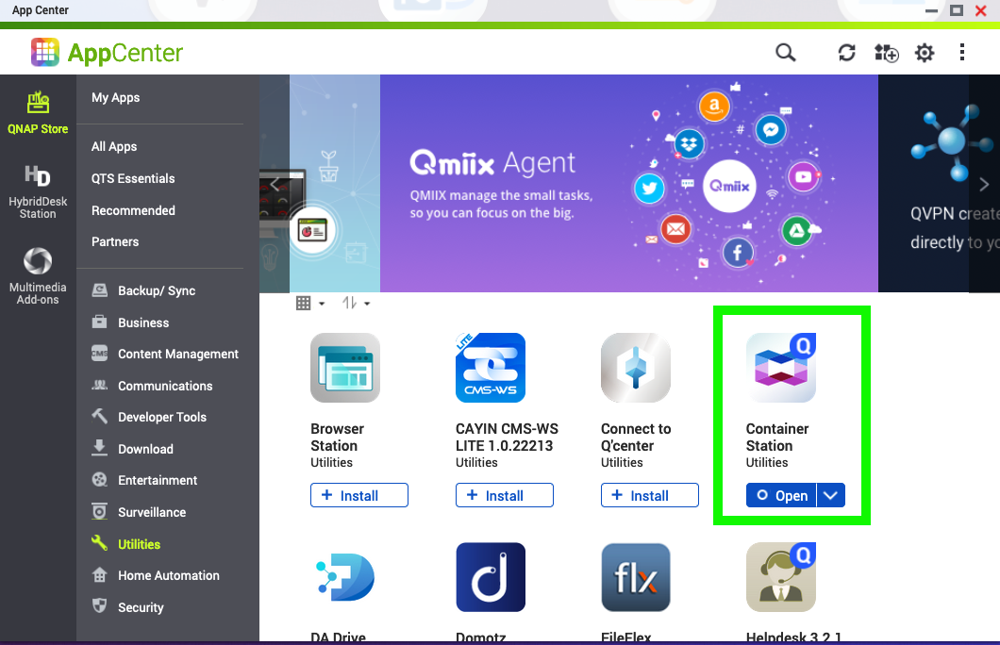
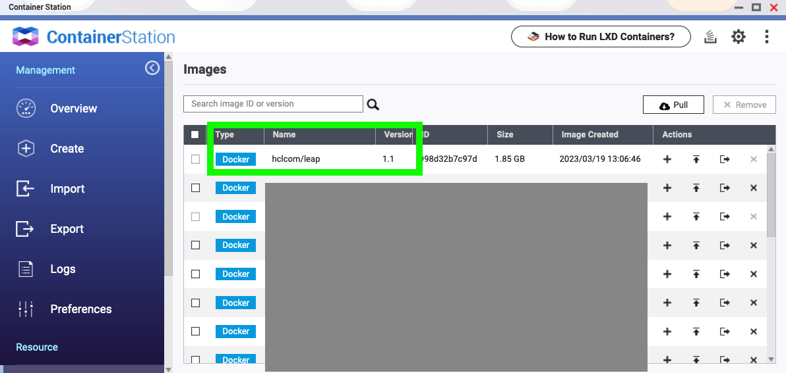
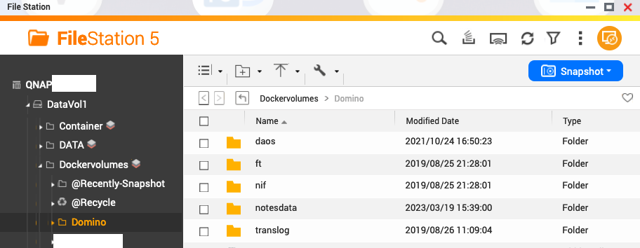
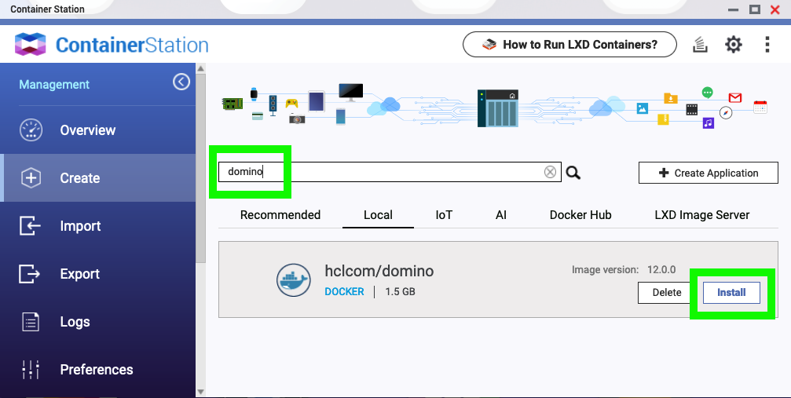
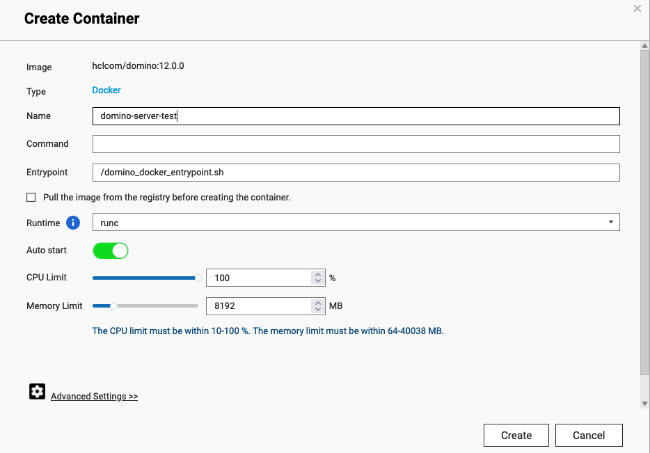
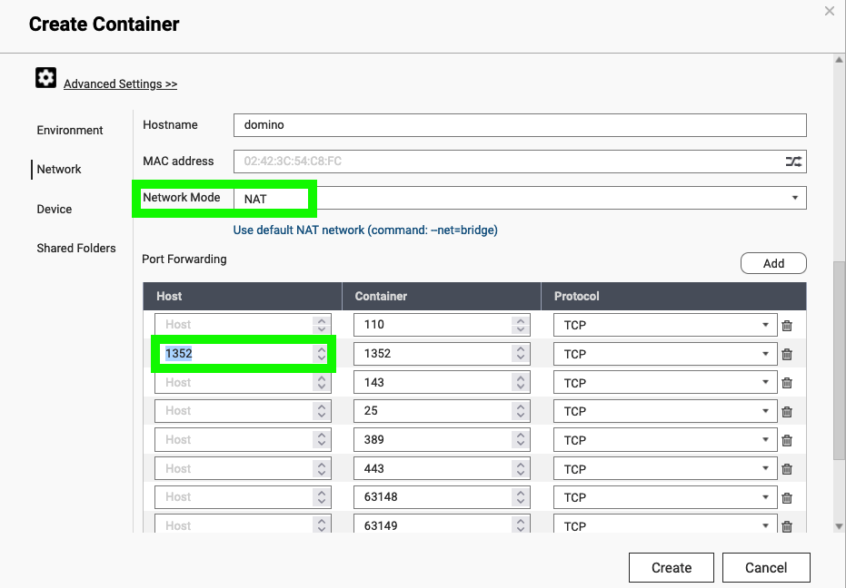
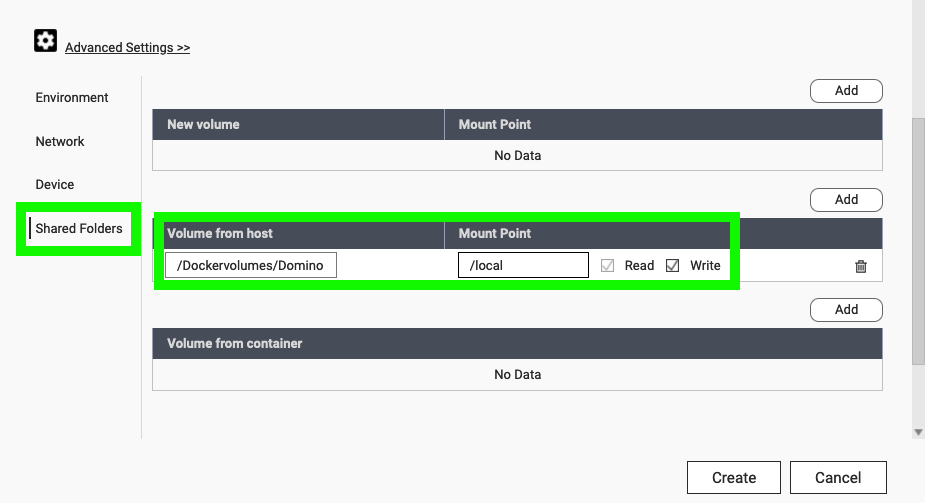
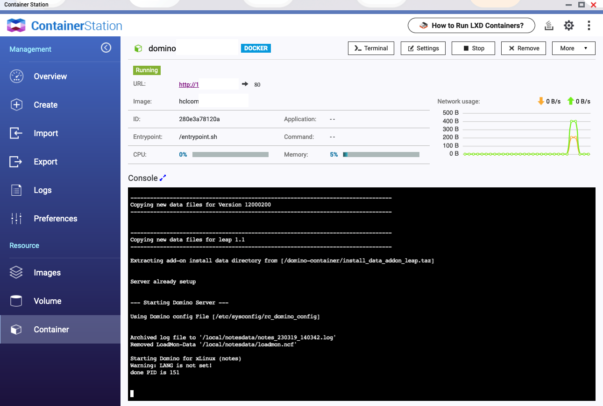

## How to run HCL Domino on a QNAP NAS
This article describes to run HCL Domino on a QNAP Network Attached Storage device.

### Background
Network attached storage devices (NAS) offer much more than just disk space these days, they are quite powerful servers overall. Certainly good enough to run HCL Domino. 

**Why QNAP ?**
Simply because we had the device available and tried it. Other vendors like [Synology](https://www.synology.com) should work as well. If time permits we will publish instructions for other platforms as well.

### Requirements
A [QNAP Network Attached Storage device](https://www.qnap.com/en-us/product/) which meets the following criteria:
- x86 compatible CPU (avoid the ARM CPU's like Marvel or AnnapurnaLabs - they will not work!) 
- runs [Container Station](https://www.qnap.com/en-us/software/container-station)
- somewhat meets the official [Domino system requirements](https://support.hcltechsw.com/csm?id=kb_article&sysparm_article=KB0073794) for free disk space, memory and CPU resources available
- (optionally) a workstation to be used for building your image

### Recommendations
While it is possible to run Domino on devices with 2GB of memory or even less, a production deployment should consider using:
- 8 GB of memory
- 2 CPU cores (preferably MultiThreaded)
- 4 Bays for a redundant HDD configuration e.g. RAID 5
- a Gigabit LAN connection
  
## Instructions
On high level, you need to:
1. Install Container Station from the QNAP AppStore
2. Prepare your Docker image, either by [downloading a ready-built image](./howto_download-software.md) or by [building your own](./reference_build.md)
3. Upload the image to ContainerStation
4. Create a persistent volume (or use an existing folder on your NAS)
5. Run a container based on the image

### Step-by-Step
Ok, here the instructions for newbies

### 1. Install ContainerStation
Login to your QNAP NAS Admin user interface using a web browser.
In "App Center", search for ContainerStation and click on install if it is not already installed.


### 2. Prepary a Docker image
This step needs to be completed **outside** the QNAP NAS, e.g. on your workstation, etc.

There are two options to choose from:

a) just download the HCL Domino Docker image - no further actions required, you can continue to the next chapter

b) build your own image - e.g. an "all inclusive" image containing Domino, Verse, Nomad, ..., and Leap

For option b) see [instructions](/docs/quickstart.md) for cloing this repo and downloading the required installation files.

To build an image that contains Domino, Verse and Nomad all together, issue this command:
```bash
./build.sh domino +verse +nomad
```
On top of this Domino 'base' image above, you can now build an image which also contains HCL Domino Leap (aka Domino Volt). It must be built in two steps because Domino Leap requires a different license.
```bash
./build.sh leap
```
#### Export the image to a *.tar file
Export the image that was built above into a *.tar file on your machine
usage:
docker image save -o YourTargetFilename.tar imagename:tag

```bash
docker image save -o ./domino1202-verse-nomad.tar hclcom/domino:12.0.2
```
or for the Leap image:
docker image save -o ./domino1202-verse-nomad-leap.tar hclcom/leap:1.0.1

### 3. Upload the image to ContainerStation
Uploading the image to your NAS will transfer the image file over the network. This file is between 1.5GByte and 2GByte in size. To avoid excessive load times please prefer a wired network connection to your NAS. 

**Via the Browser**
- Open ContainerStation on your QNAP NAS
- Click "Import" in the left side navigator
- Click "Import" in the top right corner to open the import image dialog
- Choose the location of the *.tar file
- Confirm the import
Depending on your network bandwidth this process may take some time.
- validate the import was successful by clicking on "Images", where you should now be able to see the image:


**Via Command Line**
- Copy the *.tar file exported above to a directory on your QNAP NAS
- [SSH into the NAS](https://www.qnap.com/en/how-to/faq/article/how-do-i-access-my-qnap-nas-using-ssh) using admin privileges. Note: SSH access needs to be enabled on your NAS first!
- Navigate to the directory into which you have uploaded the *.tar file
- Import the image using the following command
```bash
docker image load -i ./YourImageFilename.tar 
```
- validate the import was successful by typing - you should see the image name listed in the output
```bash
docker images
```
- Exit / close the SSH session

### 4. Create a persistent volume
Since we want any Domino Data to be persistent, meaning to survive a the container to be killed/replaced with a newer one, we need to define a [docker volume](https://docs.docker.com/storage/volumes/).

The easiest method is to use a docker volume at the time of starting the container. 
However, this will not, or not easily, allow to access Domino data files over a network share.
Skip to the next chapter if this is ok.

To easily access the Domino Data directory over your QNAP network file share/SMB, you first need to create a folder on your NAS and condition it for the docker runtime to get access.

- Create an empty directory on your NAS, e.g. using FileStation. All files in here will be persistent. Best Practice is to create a folder for each type of data, e.g. notesdata, translog, nif, ft, daos. Even if you don't use them now, create subdirectories as shown here:
 
- Change the owner of the folder so that the docker runtime will have the required permissions 

The root of this folder will be mounted to /local inside the container in the next step.

### 5. Run a container with Domino
Finally let's start a Domino container:

- Within ContainerStation on your QNAP NAS, click on "Create" and search for "domino" (or 'leap' if you have used that image). It should find the image you uploaded earlier on 'local' - click "install" as shown:

- Define a meaningful name for the container and change resource limits for CPU and memory as needed 

- Open **Advanced Settings** to change network settings. 
Define a hostname that will be used inside the container,
at least port 1352 is exposed so that you can access this server from a client. If you don't specify a host port, QNAP will randomly assign an available TCP port. Make sure to set a host port for all ports/services you want to access later on. e.g. SMTP, HTTP(s), Nomad, etc.

- In **Shared Folders** either create a new Docker volume (which is the first) or as shown in this screenshot use the folder created in the previous step as your mount point. Use "/local" as your mount point inside the container. 

- Review all settings 
- Now really check all settings again
- Click "Create" to start the container with Domino running inside. 


This will start an empty Domino server which still needs to be configured, use the remote server setup tool and connect to port 1352 to proceed.

## What else you need to know
Your Domino server is now up and running, but what are the specialities you need to know about?
- HCL support can not help with any QNAP related questions. For questions use the [Github Issue Tracker](https://github.com/HCL-TECH-SOFTWARE/domino-container/issues)

### Security
The best security is dependent on the weakest link. So...
- for QNAP admin account(s) using [two factor authentication](https://www.qnap.com/en-us/how-to/faq/article/setting-up-the-2-step-verification-to-login-in-nas) (TOTP) is a musthave.
- Disable any services not used, e.g. Multimedia
- Do not directly expose the NAS to the Web, only expose the ports you really need.
- Learn about [Hardening QNAP Devices](https://www.youtube.com/watch?v=FeYbfkCfwSc)

### Port mapping
When the container is using the IP address of the NAS, all applications, all containers, etc. will be sharing the same IP address. The Domino port 1352 can only be assigned to exactly one container. If more than one Domino server is running on your NAS, the container itself can still expose port 1352 but it will need to be mapped to another TCP port when running the container. ContainerStation will not allow to create a container with a port conflict.

### How to migrate my existing server?
Instructions above are for a new/empty Domino server. If you have an existing server.id with existing Domino data that you want to move into this container, you need to perform the following:

- After completing the Step-by-step instructions above, shut down the container by using the stop button in ContainerStation
- Copy your existing Domino Data directory into the persistent volume created earlier. Hint: this is much easier when you have used a "volume from host" mount point that you can access as a file share.
- Make sure to update file/folder owner and permissions accordingly
- Check notes.ini and server document (by opening the names.nsf from the file share) for hardcoded path/file names from your previous server and update them. Especially check DAOS, FT and Translog folder settings.
- When moving from Windows to Linux, **be warned**, the file system is case sensitive!

### Compatibility
The following list of QNAP devices have been reported to be working fine:
- TVS-682

Note: there may be many, MANY more - we just have not tested them all

### References
some useful references
- [How to use ContainerStation](https://www.qnap.com/en/how-to/tutorial/article/how-to-use-container-station-2)
- [Hardening QNAP Devices](https://www.youtube.com/watch?v=FeYbfkCfwSc)

### Final Remarks
This guide has been written based on the [QTS operating system](https://www.qnap.com/qts/5.0.1/en-us/) of QNAP. While commands listed above and ContainerStation should work the same on [QuTS Hero](https://www.qnap.com/en-us/operating-system/quts-hero/5.0.1) it has not been tested explicitly. Your milage may vary, but we welcome your feedback 