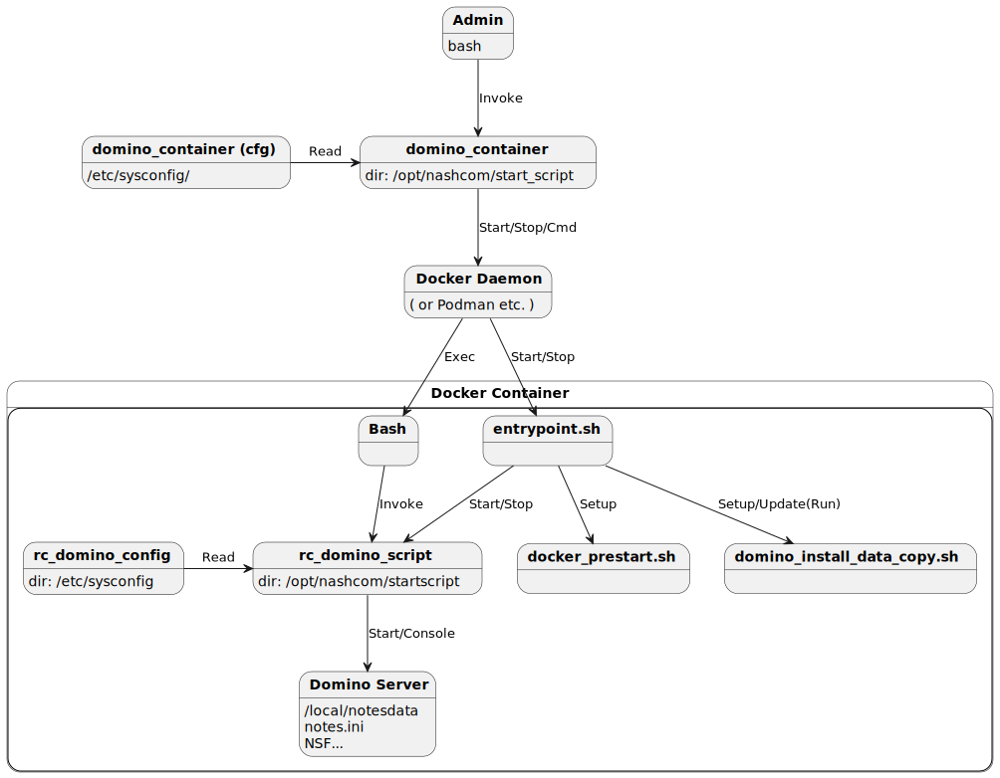

The default configuration should work for most environments.  
For special requirements check the documentation for details.

## Ensure you have a supported build environment

The project supports most Unix base environments including [Windows Subsystem for Linux 2 WSL2](https://docs.microsoft.com/en-us/windows/wsl/)

For details check [supported run-time and build environments](concept_environments.md)

## Clone this project via Git

### Install Git software

Git is a very simple and convenient way to download from GitHub.
The install command vary per platform (SUSE: zypper, Ubuntu: apt).
"yum" works for any Redhat/CentOS based distribution.

```
yum install git -y
```

### Create new main directory for the project

Create a directory where to download Git projects and switch to it.

Example:

```
mkdir -p /local/github
cd /local/github
```

### Clone the repository and switch to the directory

```
git clone https://github.com/IBM/domino-docker.git
cd domino-docker
```

## Download software from Flexnet

Before you can start the build process, you have to provide the right HCL web-kits to your server or specify a remote download location.  
Run the build script below provides you with detailed information and Flexnet download links for the required software.

See howto [download software](howto_download-software.md) for details.

## Build the image

```
./build domino
```

## Run container Domino Container Script

The Nash!Com Domino container script allows you to operate your server. It supports Docker and Podman run-time environments.

### Install Domino Container script

```
../start_script/install_domino_container
```

### Configure your container

The project provides with a default configuration.
Usually the default configuration should work for your environment.
You might want to change the container name and other detailed settings.


```
domino_container cfg
```

**Note:** The container script by default uses `vi` for editing.
In case you want to use a different editor like `nano` or `mcedit` export a variable with the editor of your choice.
Tip: You can also add the variable to your bash profile.

```
export EDIT_COMMAND=nano
```

### Configure container setup

Usually environment variables are used for setup.
The following commands opens the environment file, configured for your container.

```
domino_container env
```

## Start Domino container

After specifying the configuration and setup correctly, start the container with the Domino container script.

```
domino_container start
```

### Live Domino console

To start a Domino live console, run the console command.
The domino_container script leverages and `exec` command into the container.
The long version of this command would be `domino_container domino console`.

All console commands can be executed via `domino`.
This command passes command line parameters to the `domino` start script.

```
domino_container console

```

## Domino Container Script Diagram



